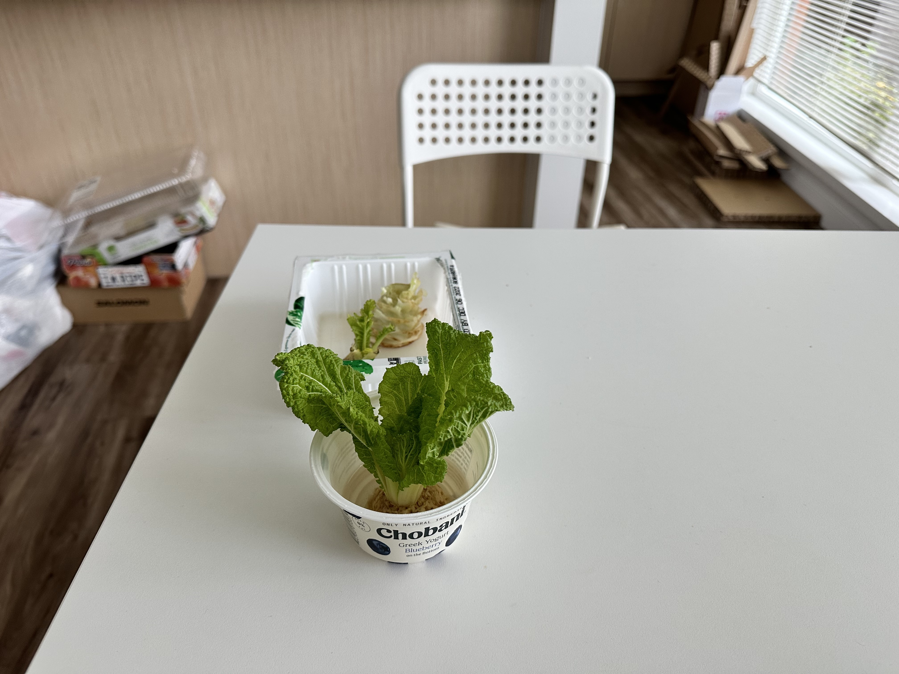
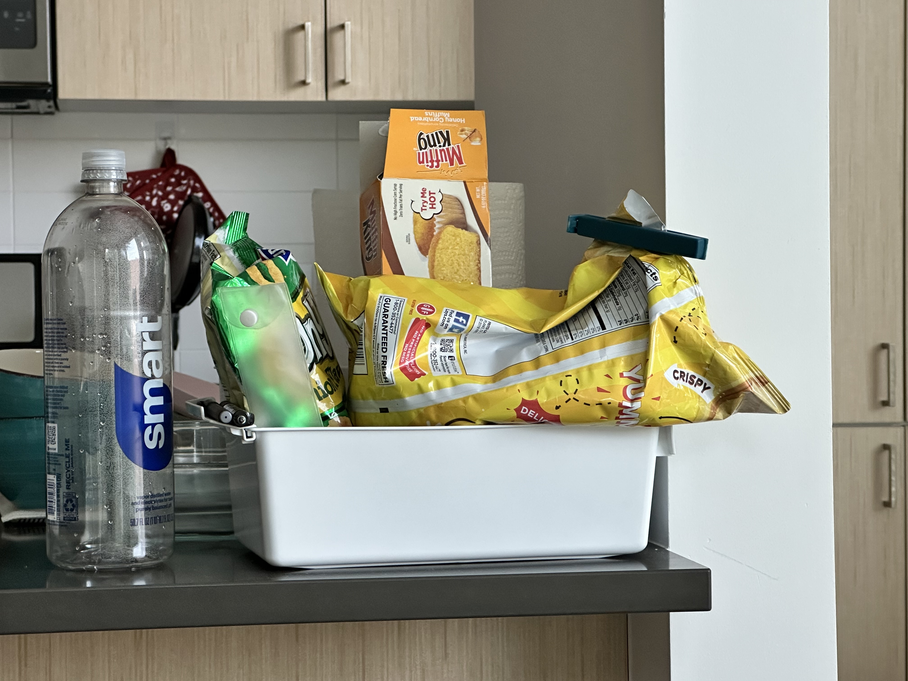
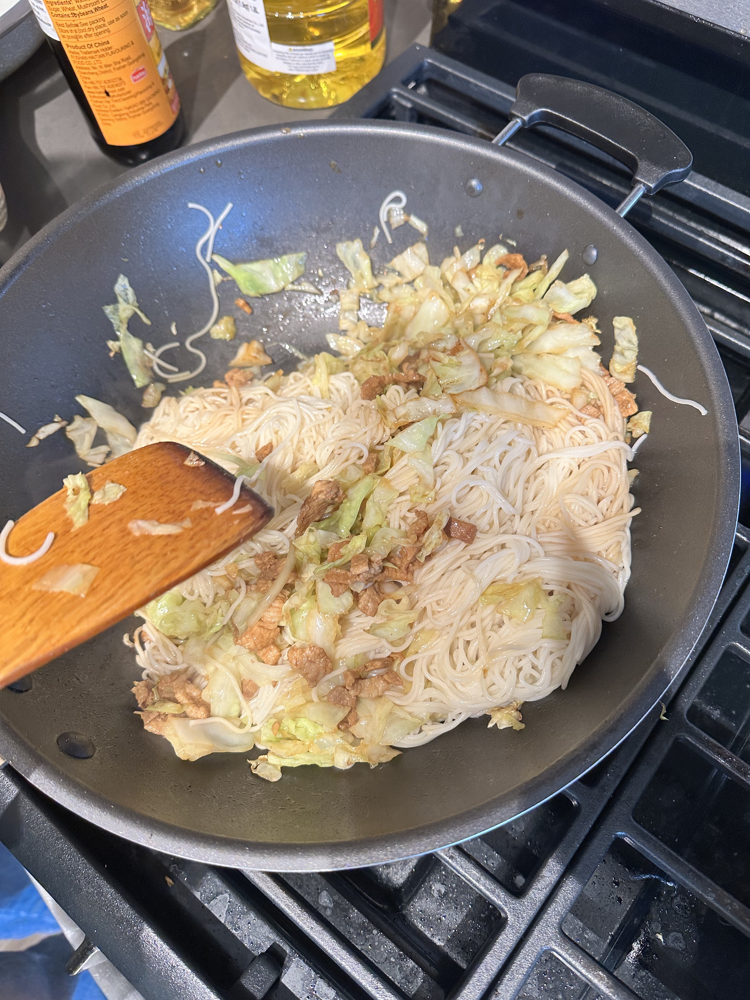
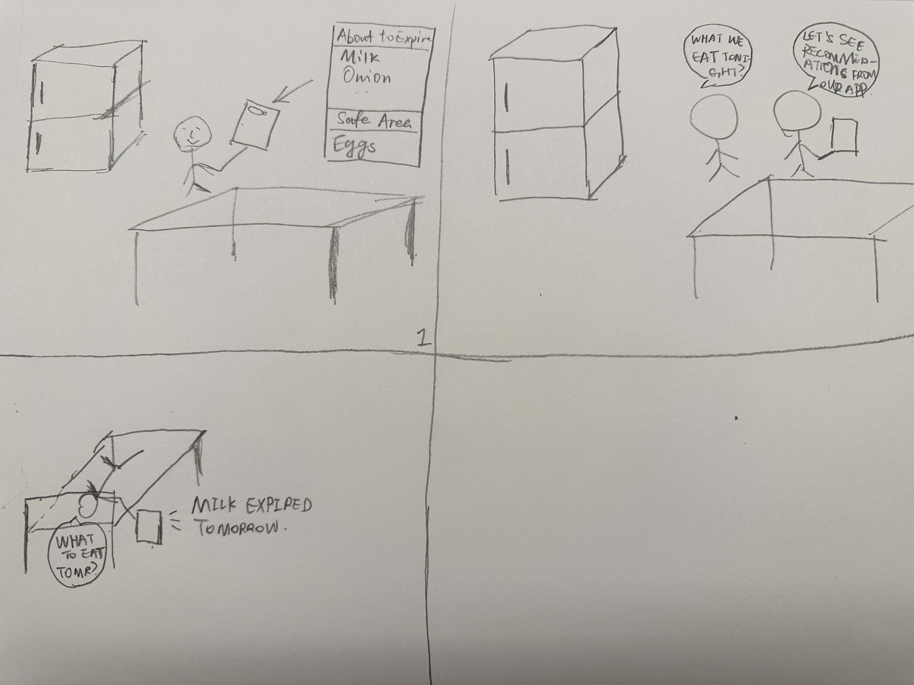

# Food Tracker Design Developing and Thinking
For A6 Project Website

## Basics
This repo is a work documentation about a course I took in Global Innovation Exchange - Design Thinking Studio. During the 10-week quarter of Autumn 2022, our team designed and prototyped a product - Food Tracker that let users track food in their refrigerator with two fundamental functions, which are expiration date reminders and daily recipe recommendations. Note that the project is not code-driven but focuses on user-centered design and prototypes. So you would be expected to see my journey of being on a product management and designing team rather than browse code snippets of the Food Tracker.

## My Role On the Team
I define myself as a technical support guy of the team. At the beginning of this course, I thought there might be a technology solution to demonstrate our prototype and make the product real. As the course progressed, I realized the core part of this course would be a thinking and collaboration process in a product design team. So gradually, I turned myself into a position that could provide information and support to our product from the “programmer's perspective”. If it were out of the course, my role at the team would be a senior software engineer that can help settle down requirements and make decisions together with the product managers, designers, and business guys on the team.


## Design Topic Brainstorming
The Design Thinking Studio course started with an assigned group distribution that every team member in the group comes from a different background. At the first meeting of our group, honestly I would say it wasn't going well. As a software engineer, I always thought about a problem from the technology perspective, while my team members, who previously worked as either a product manager or a designer, talked about how they make the USERS as the center for their design. I made an example on how Google pushed their data center to work harder when the the sun shines and wind blows to make energy more efficient. I was excited about how Google made such a smart move, and it could bring inspiration to our product design – if we could make individual developer's work to a centered place that uses less energy. I thought this could be a good idea but later my teammates persuaded me this solution might not work for most USERS. So we shifted our design topic into a field that could be more user-centered and more considerable for most of our target audience.

That is how in the later meeting we shifted our design topic to discover the relationship between **students and food planning**. We didn't formate a solid design question in the brainstorming section, but in retrospect I think this section left me a good impression of how design thinking should be like and how effective team work should be like.

## Design Question - 1st
We concluded our first version of the design question as follow,

```
How can we help consumers buy food in moderation at supermarkets and thus reduce carbon emissions from food waste?
```

## Field Study Plan
After determining the first iteration of the design question, we started to look for participants to make our field study plan to see if there were any requirements that we could gather. We were also considering make this field study an opportunity to look into our target users to see how their daily food planning and cooking process can be, so that we can better understand the design questions and tasks we'd like to draw. Before the field study began, we made a list of a dozen of questions ahead as follows:

- How do students plan their grocery trips?
- How often do students make plans for their grocery shopping?
- What factors do students consider when deciding to buy an item?
- Do students normally consume all the food they plan to buy?
- What difficulties do student face when they plan their grocery shopping?
- What does not go to plan in grocery planning?
- What types of food are wasted the most?
- What are the reasons for wasting food?
- How many meals do students plan for one grocery trip?
- How many people are included in their grocery plan?
- How do the students prepare and cook the food? How many ingredients are prepared at a time? What do they do with them?
- What do the students do with the leftovers after they have eaten?

Clearly in our mind was our target audience was students who live either alone or with 2 or 3 roommates that should cook at a relative high frequency compared to their previous lives. They have almost no experience of living alone and having to cook for themselves, they often waste food for various reasons. They also often encounter unplanned situations, such as a get-together with friends, a meal provided by the school, etc. Our group plans to explore these reasons. We would also like to know the difference between different sizes of households' meal preparation.

## Observations and Field Notes
In the rainy noon of Oct 24, I went by my friends’ apartment and asked their permission to take a 30-minute observation of their preparations for lunch. After getting verbal consent from all three of them, I entered their kitchen and found a place to be seated and make the observation.

At the first place, I did not expect I could find out so many points in the observation process. But it finally turned out that when I faced my friends silently, it was completely a different experience. Especially when they started to prepare for the lunch, lots of things happened and I was swiftly taking notes. Some of them are as follows:

### Pre-Lunch Observation
- On the dining room table, there is a decoration of lettuce and a box of used yogurt.
- They used a klip to wrap up unfinished Lays chips.
- They bought a Smartwater bottle of water, which is super large.
- They use expired juice to trap fruit flies.

### Food Preparation
- They turned the tap to max volume of water to wash vegetables.
- One of the girls randomly select three potatoes from the box.
- One of the girls turned the tap just a little bit when she washed her hands. This is different
from what they did when they washed vegetables.
- They were planning to cook chow mein with pork and cabbage. They estimated the amount of noodles without any tools.
- They washed the cabbage for three rounds in total.

### Cook
- They used medium fire to cook noodles all the way.
- After cooking the noodles, they use the original pot to filter water instead of moving them
to another container.
- They overestimated the time to cook the noodles, so they added a spoon of oil to the
noodles.
- They cooked the pork first. Then used the pork oil remained to cook the cabbage.







#### Observation Reflections
Observation can give me more than just the validation of our design and requirements analysis from our projects, but most importantly for me would be our potential user’s persona. Even though the observation is a non-talk process, which means I don’t have the opportunity to do something like interviewing or surveying our target audience in the observation, their attitudes, behaviors, and habits are exposed to me that can help me understand what is a lack in the general workflow of our designed scenario.

Take our project as an example. I was doing an observation at one of our colleague’s homes. They were keeping a very healthy and low-carbon lifestyle. They have the consciousness to reduce general waste during food preparations like they would turn the water tap to a slight volume of water to wash vegetables instead of maximum. I think these observations left me a very well impression of what is like about our target users, what their daily cook is like, and what their preferences for decreasing carbon emissions are like. I think my reflection would be in maybe future product design process, and I would consider more using this tool to observe what my users would behave in the particular scenario apart from basic interviewing and sending out questionnaires, because I think the observation could give me a better knowledge of my user’s persona.

## Design Question - 2nd
The refined design question after field study and observation has been updated to

```
How can we help off-campus students to make grocery plans more efficient to prevent food waste and thus reduce carbon emissions?
```

## Survey Design, Distribution, and Insights
Observation and field study could not give us a full picture of our target audience. In this stage, we would like to learn more about what our users are really interested in and how well or bad are their preservation habits are. Our team ended up designing an 11-question-survey with Google Forms to be distributed in WeChat group. The questionnaire mainly focusing on users' cooking habits, including the frequency of cooking/purchasing grocery, the proportion and reasons for discarding food, the preference of purchasing food, the habits and perceptions of food preservation, and so on. 33 responses were collected and enough for us to generate insights.

The survey questions were trivial and easy for our respondents to answer. The most crucial point we found in the survey was that users might now have a consciousness of preserving food if they live alone or in a group of 3 to 4 people. For example, one-third of the students throw away 5%~20% of their food, and 15% throw away 20%~45% of their food. And students have no idea of how many ingredients they should prepare. For one-third of them, how many ingredients they cook depends on how many ingredients are in the bag they buy.

So later we upgraded our design to emphasize more on students themselves and tried to think about a solution that can increase their knowledge on food preservation.


## Design Question - 3rd (Final)
```
How to increase students’ knowledge in food preservation to minimize the carbon emission in food waste?
```
## Ideation
After deciding the final version of design question, we started on brainstorming about the solution. We considered scenarios, drew sketches and walked-through the context of food preservation and planning process. Here are three basic scenarios we came up with:

<details>
<summary>Scenario 1</summary>
Mary and John are a pair of couples living together. They have most of their meals together in their household. Before planning his weekly meal plan, he uses the app to check what food is left in his fridge and its expiry date that he recorded after his last purchase. The app then shows the information and the suggested recipes for the coming days to use up the expiring food. He can add them to his weekly meal plan. Then, he asks Mary about her plan for the week and ticks out the meals they intend to dine out. John proceeds by filling up the remaining weekly meal plan with either suggested or other recipes. The app will generate a grocery list for the couples for the coming week. The couple goes to the grocery store to buy the food with the generated list to avoid overbuying and considering the expiration date of their current food.
</details>

<details>
<summary>Scenario 2</summary>
Alex is a graduate student. He lives in an apartment with his friend Tommy. On a Sunday afternoon, Alex and his friend Tommy go home after shopping at the supermarket. They each buy a large bag of food, which is their food for the coming week. Alex takes out food from the bag. There are lettuce, tomatoes, potatoes, steak, bread, and so on. Then he opens the app on his phone and records the name, portion size and date of purchase of these foods he just bought one by one. The app immediately shows the corresponding storage methods. following the instructions, Alex puts the vegetables in the refrigerator and the potatoes in the storage cabinet. Then he can see all the food he bought on the app, including the ones he bought today and the ones he bought before. After organizing the food, Alex plans to take a break and have a bottle of yogurt. He is not sure if he bought the bottle of yogurt or Tommy bought it, so he enters the yogurt information on the app and finds that he does have two bottles of yogurt that he has not yet drunk.
</details>

<details>
<summary>Scenario 3</summary>
Charles, a single graduate student, lives in an apartment with no public food services. He takes great care of what food he purchases and stored in his home, but sometimes he still forgot to cook some vegetables he bought before dropping it. Once he downloaded our app and started to log food he preserved it. Every time he goes to the supermarket, he uses this app to keep information about the food count and expiration date. He will follow the expiration date to cook the food accordingly. The built-in calendar reminder function lets him know the exact date he should cook something that is about to expire. He will look at the app for recipe recommendations and check which food is needed to be cooked first. Also, he found this app is improving his life quality and bringing him so many inspirations because an automatic recipe recommendation system is also available and can put different combinations of food that he already stored in the refrigerator to him.
</details>



## Prototype and Evaluation
We first prototyped our low-fidelity interface of the app in Figma, and then we used Figma’s automatic scene to generate a simulated app that can run on smartphones for users to navigate and explore our app. Before each participant’s session, we provided a digital instruction to them showing the flows, core tasks and user privacy issues. The moderator then started to introduce the tasks and answer questions from the participants. When participants were performing each task, the moderator reminded them to think aloud while the note-taker recorded each reflections the participant were doing. The Figma simulated app is clickable so that both the users and moderators know the interface and logic of the food planning, preserving and recipe recommending process in a whole.

The prototype fidelity in our usability evaluation session is both low and medium. We used Figma to design each page presented in our application. The Figma simulated app, on the other hand introduces the physical clickable effects that can make users navigate through each page and explore the connections between each page and interface.

## Personal Reflections
The biggest reflection to me in the design thinking course is the adoption of using many iterations to gradually finalize either our design question or the prototype. At the beginning of this course, I thought we could just use three or four meetings to design everything for this course. But later it turned out to be not that case. We continuously received feedback from users, from ourselves and from the survey data points or observation details. This feedback pushed us to think more, to practice more, and to facilitate more on our design to make improvements. In retrospect, I think this is the most fruitful lesson I learned from DT. I hope later in my work, I can apply this culture of multi-iterations to make things effective.

Apart from that, this brand new experience of collaboration with colleagues from different backgrounds is also interesting. Before attending classes at GIX, I came from a school which were filled with tech guys. At that time, my team was always something pioneering on cutting technologies, scientific discussions etc. By bringing together a diverse group of people with different backgrounds and expertise, this course fosters a sense of community and provide a space for open and honest dialogue. This not only helps to generate new ideas, but also ensures that any solutions that are developed are well-rounded and take into account the needs of all stakeholders.

So finally, I would say thank you for this course. It brought me so much and what a great 10-week journey it was!
